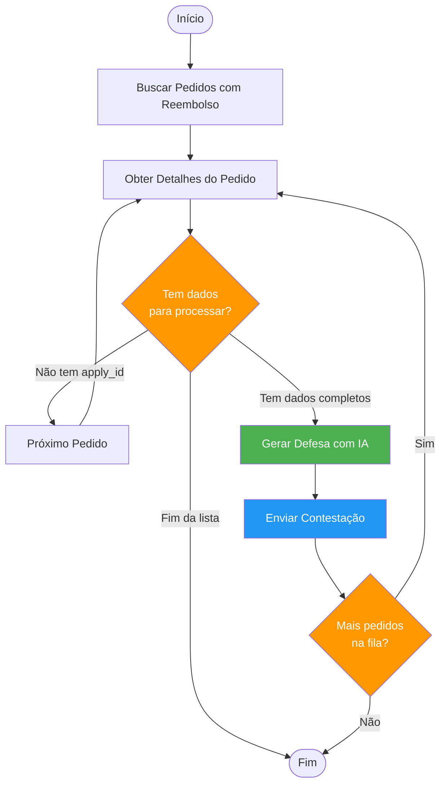

# 🏗️ Arquitetura do Sistema

## Visão Geral

O sistema utiliza **LangGraph** para orquestrar um fluxo de trabalho complexo de forma declarativa e escalável.

## Diagrama do Grafo de Execução



## Componentes Principais

### 1. **Config (`config.py`)**

Gerencia variáveis de ambiente usando Pydantic Settings.

```python
class Settings(BaseSettings):
    llm_provider: str  # openai | gemini
    llm_model: str     # gpt-4o | gemini-1.5-pro
    openai_api_key: str
    google_api_key: str
    base_api_url: str
```

### 2. **Models (`models.py`)**

Define schemas Pydantic para tipar as respostas da API:

- `RefundListResponse`: Lista de pedidos com reembolso
- `OrderDetailResponse`: Detalhes completos do pedido
- `RefundDetail`: Informações específicas do reembolso (motivo, imagem, etc.)
- `AppealRequest`: Payload para enviar contestação

### 3. **API Client (`api_client.py`)**

Cliente HTTP usando `httpx` para comunicação com a API 99Food.

```python
class APIClient:
    def get_refund_orders(...) -> Dict
    def get_order_detail(order_id) -> Dict
    def submit_appeal(order_id, apply_id, comments) -> Dict
```

### 4. **LLM Client (`llm_client.py`)**

Factory Pattern para abstrair provedores de IA.

```python
# Interface abstrata
class LLMClient(ABC):
    def generate_defense(reason, items, image_url) -> str

# Implementações concretas
class OpenAILLMClient(LLMClient)  # GPT-4o com visão
class GeminiLLMClient(LLMClient)   # Gemini 1.5 Pro com visão

# Factory
def create_llm_client(settings) -> LLMClient
```

**Capacidade Multimodal:**

Ambos os clientes suportam análise de imagens. Quando `image_url` é fornecido, a IA analisa:
- O texto da reclamação
- A imagem de prova
- Os itens do pedido

E gera uma defesa que considera todos esses elementos.

### 5. **Agent Graph (`agent_graph.py`)**

Coração do sistema. Define o grafo de execução usando LangGraph.

#### Estado do Agente

```python
class AgentState(TypedDict):
    start_date: str
    end_date: str
    order_ids: List[str]
    current_order_index: int
    current_order_id: Optional[str]
    current_apply_id: Optional[str]
    current_reason: Optional[str]
    current_items: Optional[str]
    current_image_url: Optional[str]
    generated_defense: Optional[str]
    appeals_sent: int
    errors: List[str]
```

#### Nós do Grafo

1. **fetch_refund_orders**: Busca lista de pedidos
2. **get_order_details**: Extrai detalhes de um pedido
3. **generate_defense**: Invoca IA para criar argumentação
4. **submit_appeal**: Envia contestação via API

#### Arestas Condicionais

- `should_generate_defense`: Decide se há dados suficientes para processar
- `should_continue`: Decide se há mais pedidos na fila

### 6. **Main (`main.py`)**

Script principal que orquestra tudo:

1. Carrega configurações
2. Instancia clientes (API + LLM)
3. Cria e executa o agente
4. Exibe resumo final

## Fluxo de Dados

```
┌─────────────────────────────────────────────────────────┐
│                   Configurações (.env)                   │
└─────────────────────────────────────────────────────────┘
                            │
                            ▼
┌─────────────────────────────────────────────────────────┐
│                      main.py                             │
│  - Carrega settings                                      │
│  - Cria APIClient                                        │
│  - Cria LLMClient (OpenAI/Gemini)                        │
└─────────────────────────────────────────────────────────┘
                            │
                            ▼
┌─────────────────────────────────────────────────────────┐
│              RefundContestationAgent                     │
│                                                          │
│  Estado Inicial:                                         │
│  {                                                       │
│    order_ids: [],                                        │
│    current_order_index: 0,                               │
│    appeals_sent: 0,                                      │
│    ...                                                   │
│  }                                                       │
└─────────────────────────────────────────────────────────┘
                            │
                ┌───────────┴───────────┐
                ▼                       ▼
    ┌───────────────────┐   ┌───────────────────┐
    │   API 99Food      │   │   LLM Provider    │
    │   (localhost)     │   │ (OpenAI/Gemini)   │
    └───────────────────┘   └───────────────────┘
                │                       │
                │ GET /orders/refunds   │
                │ POST /orders/detail   │
                │ POST /orders/appeal   │
                │                       │
                │                       │ analyze(text+image)
                │                       │ → defense_text
                │                       │
                └───────────┬───────────┘
                            ▼
                    ┌───────────────┐
                    │ Estado Final  │
                    │               │
                    │ appeals_sent  │
                    │ errors[]      │
                    └───────────────┘
```

## Padrões de Projeto Utilizados

### 1. **Factory Pattern**

Usado em `llm_client.py` para criar o provedor correto:

```python
def create_llm_client(settings: Settings) -> LLMClient:
    if settings.llm_provider == "openai":
        return OpenAILLMClient(...)
    elif settings.llm_provider == "gemini":
        return GeminiLLMClient(...)
```

### 2. **State Machine (via LangGraph)**

O grafo funciona como uma máquina de estados, onde cada nó transforma o estado:

```python
state = workflow.invoke(initial_state)
# estado passa por cada nó e é transformado
```

### 3. **Strategy Pattern**

A interface `LLMClient` permite trocar estratégias de IA sem mudar o código:

```python
# Ambos implementam a mesma interface
defense = llm_client.generate_defense(...)
# Funciona com OpenAI OU Gemini
```

### 4. **Builder Pattern**

O grafo é construído de forma fluente:

```python
workflow = StateGraph(AgentState)
workflow.add_node("fetch", fetch_fn)
workflow.add_edge("fetch", "process")
workflow.add_conditional_edges(...)
return workflow.compile()
```

## Escalabilidade

### Como Adicionar Novo Provedor de IA

1. Crie uma classe em `llm_client.py`:

```python
class ClaudeLLMClient(LLMClient):
    def generate_defense(self, reason, items, image_url):
        # Implementar chamada para Claude
        pass
```

2. Adicione ao factory:

```python
def create_llm_client(settings):
    if settings.llm_provider == "claude":
        return ClaudeLLMClient(...)
```

3. Configure no `.env`:

```env
LLM_PROVIDER=claude
CLAUDE_API_KEY=...
```

### Como Adicionar Novo Nó no Grafo

```python
def validate_order(self, state: AgentState) -> AgentState:
    # Lógica de validação
    return state

# No _build_graph:
workflow.add_node("validate", self.validate_order)
workflow.add_edge("get_order_details", "validate")
workflow.add_edge("validate", "generate_defense")
```

## Logs e Monitoramento

O sistema usa `logging` do Python com níveis:

- **INFO**: Progresso normal (🔍 ✅)
- **WARNING**: Situações anormais mas não fatais (⚠️)
- **ERROR**: Falhas que impedem processamento (❌)

Exemplo de log:

```
2026-01-28 21:00:00 - INFO - 🔍 Buscando pedidos com reembolso...
2026-01-28 21:00:01 - INFO - ✅ Encontrados 9 pedidos
2026-01-28 21:00:02 - INFO - 📄 Buscando detalhes do pedido 5764655...
2026-01-28 21:00:03 - INFO - 🖼️  Imagem: SIM
2026-01-28 21:00:05 - INFO - 🤖 Gerando defesa com IA...
2026-01-28 21:00:08 - INFO - 💬 Defesa gerada: Consideramos...
2026-01-28 21:00:09 - INFO - ✅ Contestação enviada com sucesso
```

## Tratamento de Erros

Cada nó trata seus próprios erros e registra no estado:

```python
try:
    # operação
except Exception as e:
    logger.error(f"❌ Erro: {e}")
    state["errors"].append(f"node_name: {str(e)}")
```

O grafo continua executando mesmo com erros parciais, permitindo processar o máximo de pedidos possível.

## Segurança

- ✅ API Keys nunca são commitadas (`.gitignore`)
- ✅ `.env` não é versionado
- ✅ Timeout de 30s para requisições HTTP
- ✅ Validação de schemas com Pydantic

## Performance

- **Requisições**: httpx com timeout configurável
- **IA**: Limite de 300 tokens por resposta
- **Processamento**: Sequencial (um pedido por vez)

Para melhorar:
- Adicionar processamento paralelo com `asyncio`
- Cache de respostas da IA para motivos similares
- Batch de múltiplas contestações em uma requisição
